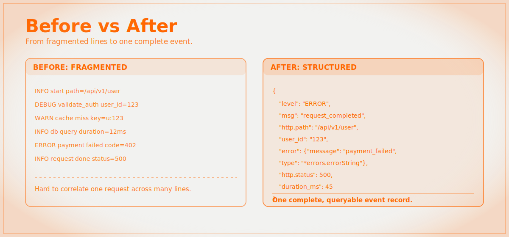

# happycontext



[](https://github.com/happytoolin/happycontext/actions/workflows/ci.yml)
[](https://github.com/happytoolin/happycontext/actions/workflows/release.yml)
[](https://pkg.go.dev/github.com/happytoolin/happycontext)
[](https://go.dev/)
[](./LICENSE)

Most application logs are high-volume but low-context.
`happycontext` helps Go services emit one structured, canonical event per request, so debugging and analysis start from a complete record instead of scattered lines.



## Why happycontext?

- Cleaner logs with one canonical event per request
- Consistent fields across handlers, middleware, and frameworks
- Built-in sampling for healthy traffic
- Error and panic events are always preserved
- Works with `slog`, `zap`, and `zerolog`
- Integrates with `net/http`, `gin`, `echo`, `fiber`, and `fiber v3`

Design principle:

- Prefer one context-rich request event over many fragmented log lines.
  

## Install

```bash
go get github.com/happytoolin/happycontext
go get github.com/happytoolin/happycontext/adapter/slog
go get github.com/happytoolin/happycontext/integration/std
```

Install only the adapter and integration packages you use.

## Quick Start (`net/http` + `slog`)

```go
package main

import (
	"log/slog"
	"net/http"
	"os"

	"github.com/happytoolin/happycontext"
	slogadapter "github.com/happytoolin/happycontext/adapter/slog"
	stdhc "github.com/happytoolin/happycontext/integration/std"
)

func main() {
	logger := slog.New(slog.NewJSONHandler(os.Stdout, nil))
	sink := slogadapter.New(logger)

	mw := stdhc.Middleware(hc.Config{
		Sink:         sink,
		SamplingRate: 1.0,
		Message:      "request_completed",
	})

	mux := http.NewServeMux()
	mux.HandleFunc("GET /orders/{id}", func(w http.ResponseWriter, r *http.Request) {
		hc.Add(r.Context(), "user_id", "u_8472")
		hc.Add(r.Context(), "feature", "checkout")
		w.WriteHeader(http.StatusOK)
	})

	_ = http.ListenAndServe(":8080", mw(mux))
}
```

Other quick starts:

- `net/http + zap` and `net/http + zerolog` are in `## More Examples`
- `gin`, `echo`, `fiber v2`, and `fiber v3` (with `slog`) are in `## More Examples`
- Runnable reference apps are in `cmd/examples`

Example output:

```json
{
  "time": "2026-02-09T14:03:12.451Z",
  "level": "INFO",
  "msg": "request_completed",
  "duration_ms": 3,
  "feature": "checkout",
  "http.method": "GET",
  "http.path": "/orders/123",
  "http.route": "GET /orders/{id}",
  "http.status": 200,
  "user_id": "u_8472"
}
```

## Configuration

`hc.Config` gives you the core controls:

- `Sink`: destination logger adapter (required to emit events)
- `SamplingRate`: `0` to `1` for healthy-request sampling
- `LevelSamplingRates`: optional level-specific sampling overrides
- `Sampler`: optional custom sampling function (full control)
- `Message`: final log message (defaults to `request_completed`)

Notes:

- Sampling is automatically bypassed for errors and server failures.
- If no sink is configured, requests still run; logging is skipped.
- Sampling behavior is consistent across all integrations (`net/http`, `gin`, `echo`, `fiber`, and `fiber v3`).

### Sampling Customization

Per-level sampling:

```go
mw := stdhc.Middleware(hc.Config{
	Sink:         sink,
	SamplingRate: 0.05, // default for healthy traffic
	LevelSamplingRates: map[hc.Level]float64{
		hc.LevelWarn:  1.0, // keep all warns
		hc.LevelDebug: 0.01,
	},
})
```

Custom sampler (route/user/latency rules):

```go
mw := stdhc.Middleware(hc.Config{
	Sink: sink,
	Sampler: func(in hc.SampleInput) bool {
		// Always keep failures and slow requests.
		if in.HasError || in.StatusCode >= 500 {
			return true
		}
		if in.Duration > 2*time.Second {
			return true
		}
		// Keep checkout requests.
		if in.Path == "/api/checkout" {
			return true
		}
		// Keep enterprise requests based on event fields.
		fields := hc.EventFields(in.Event)
		tier, _ := fields["user_tier"].(string)
		return tier == "enterprise"
	},
})
```

Built-in sampler chain:

```go
mw := stdhc.Middleware(hc.Config{
	Sink: sink,
	Sampler: hc.ChainSampler(
		hc.RateSampler(0.05),        // base sampler
		hc.KeepErrors(),             // always keep errors
		hc.KeepPathPrefix("/admin"), // always keep admin paths
		hc.KeepSlowerThan(500*time.Millisecond),
	),
})
```

Sampler building blocks:

- `hc.ChainSampler(base, middlewares...)`: composes one final `Sampler` from middleware rules.
- `hc.AlwaysSampler()`: base sampler that keeps every event.
- `hc.NeverSampler()`: base sampler that drops every event.
- `hc.RateSampler(rate)`: base probabilistic sampler (`0` drops all, `1` keeps all).
- `hc.KeepErrors()`: middleware that keeps errored requests (`HasError` or `5xx`).
- `hc.KeepPathPrefix("/checkout", "/admin")`: middleware that keeps matching path prefixes.
- `hc.KeepSlowerThan(minDuration)`: middleware that keeps requests at/above a duration threshold.

## Integrations

- `integration/std` (`net/http`)
- `integration/gin`
- `integration/echo`
- `integration/fiber` (Fiber v2)
- `integration/fiberv3` (Fiber v3)

## Logger Adapters

- `adapter/slog`
- `adapter/zap`
- `adapter/zerolog`

## More Examples

<details>
<summary>1. net/http + slog</summary>

```go
package main

import (
	"log/slog"
	"net/http"
	"os"

	"github.com/happytoolin/happycontext"
	slogadapter "github.com/happytoolin/happycontext/adapter/slog"
	stdhc "github.com/happytoolin/happycontext/integration/std"
)

func main() {
	logger := slog.New(slog.NewJSONHandler(os.Stdout, nil))
	sink := slogadapter.New(logger)
	mw := stdhc.Middleware(hc.Config{Sink: sink, SamplingRate: 1})

	mux := http.NewServeMux()
	mux.HandleFunc("/health", func(w http.ResponseWriter, r *http.Request) {
		hc.Add(r.Context(), "router", "net/http")
		w.WriteHeader(http.StatusOK)
	})

	_ = http.ListenAndServe(":8101", mw(mux))
}
```

</details>

<details>
<summary>2. gin + slog</summary>

```go
package main

import (
	"log/slog"
	"os"

	"github.com/gin-gonic/gin"
	"github.com/happytoolin/happycontext"
	slogadapter "github.com/happytoolin/happycontext/adapter/slog"
	ginhc "github.com/happytoolin/happycontext/integration/gin"
)

func main() {
	logger := slog.New(slog.NewJSONHandler(os.Stdout, nil))
	sink := slogadapter.New(logger)

	r := gin.New()
	r.Use(ginhc.Middleware(hc.Config{Sink: sink, SamplingRate: 1}))
	r.GET("/users/:id", func(c *gin.Context) {
		hc.Add(c.Request.Context(), "router", "gin")
		c.Status(200)
	})

	_ = r.Run(":8105")
}
```

</details>

<details>
<summary>3. fiber v2 + slog</summary>

```go
package main

import (
	"log/slog"
	"os"

	"github.com/gofiber/fiber/v2"
	"github.com/happytoolin/happycontext"
	slogadapter "github.com/happytoolin/happycontext/adapter/slog"
	fiberhc "github.com/happytoolin/happycontext/integration/fiber"
)

func main() {
	logger := slog.New(slog.NewJSONHandler(os.Stdout, nil))
	sink := slogadapter.New(logger)

	app := fiber.New()
	app.Use(fiberhc.Middleware(hc.Config{Sink: sink, SamplingRate: 1}))
	app.Get("/users/:id", func(c *fiber.Ctx) error {
		hc.Add(c.UserContext(), "router", "fiber-v2")
		return c.SendStatus(200)
	})

	_ = app.Listen(":8107")
}
```

</details>

<details>
<summary>4. fiber v3 + slog</summary>

```go
package main

import (
	"log/slog"
	"os"

	"github.com/gofiber/fiber/v3"
	"github.com/happytoolin/happycontext"
	slogadapter "github.com/happytoolin/happycontext/adapter/slog"
	fiberv3hc "github.com/happytoolin/happycontext/integration/fiberv3"
)

func main() {
	logger := slog.New(slog.NewJSONHandler(os.Stdout, nil))
	sink := slogadapter.New(logger)

	app := fiber.New()
	app.Use(fiberv3hc.Middleware(hc.Config{Sink: sink, SamplingRate: 1}))
	app.Get("/users/:id", func(c fiber.Ctx) error {
		hc.Add(c.Context(), "router", "fiber-v3")
		return c.SendStatus(200)
	})

	_ = app.Listen(":8108")
}
```

</details>

<details>
<summary>5. echo + slog</summary>

```go
package main

import (
	"log/slog"
	"os"

	"github.com/happytoolin/happycontext"
	slogadapter "github.com/happytoolin/happycontext/adapter/slog"
	echohc "github.com/happytoolin/happycontext/integration/echo"
	"github.com/labstack/echo/v4"
)

func main() {
	logger := slog.New(slog.NewJSONHandler(os.Stdout, nil))
	sink := slogadapter.New(logger)

	e := echo.New()
	e.Use(echohc.Middleware(hc.Config{Sink: sink, SamplingRate: 1}))
	e.GET("/users/:id", func(c echo.Context) error {
		hc.Add(c.Request().Context(), "router", "echo")
		return c.NoContent(200)
	})

	_ = e.Start(":8106")
}
```

</details>

<details>
<summary>6. net/http + zap</summary>

```go
package main

import (
	"net/http"

	"github.com/happytoolin/happycontext"
	zapadapter "github.com/happytoolin/happycontext/adapter/zap"
	stdhc "github.com/happytoolin/happycontext/integration/std"
	"go.uber.org/zap"
)

func main() {
	logger := zap.NewExample()
	sink := zapadapter.New(logger)
	mw := stdhc.Middleware(hc.Config{Sink: sink, SamplingRate: 1})

	mux := http.NewServeMux()
	mux.HandleFunc("/health", func(w http.ResponseWriter, r *http.Request) {
		hc.Add(r.Context(), "example", "adapter-zap")
		w.WriteHeader(http.StatusOK)
	})

	_ = http.ListenAndServe(":8102", mw(mux))
}
```

</details>

<details>
<summary>7. net/http + zerolog</summary>

```go
package main

import (
	"net/http"
	"os"

	"github.com/happytoolin/happycontext"
	zerologadapter "github.com/happytoolin/happycontext/adapter/zerolog"
	stdhc "github.com/happytoolin/happycontext/integration/std"
	"github.com/rs/zerolog"
)

func main() {
	logger := zerolog.New(os.Stdout).With().Timestamp().Logger()
	sink := zerologadapter.New(&logger)
	mw := stdhc.Middleware(hc.Config{Sink: sink, SamplingRate: 1})

	mux := http.NewServeMux()
	mux.HandleFunc("/health", func(w http.ResponseWriter, r *http.Request) {
		hc.Add(r.Context(), "example", "adapter-zerolog")
		w.WriteHeader(http.StatusOK)
	})

	_ = http.ListenAndServe(":8103", mw(mux))
}
```

</details>

Runnable commands are also available in `cmd/examples`:

```bash
cd cmd/examples
go run ./adapter-slog
go run ./adapter-zap
go run ./adapter-zerolog
go run ./router-std
go run ./router-gin
go run ./router-echo
go run ./router-fiber
go run ./router-fiberv3
go run ./sampling-inbuilt
go run ./sampling-custom
```

## Release Process

- CI: `.github/workflows/ci.yml`
- Release automation: `.github/workflows/release.yml`
- Go proxy sync: `.github/workflows/go-proxy-sync.yml`

## References

- Framing inspiration: "Logging Sucks - Your Logs Are Lying To You" by Boris Tane: https://loggingsucks.com/

## License

MIT
