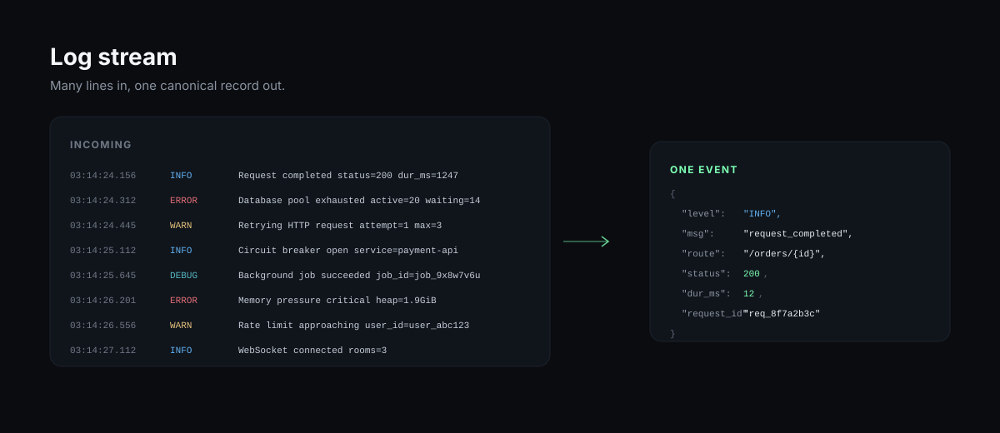
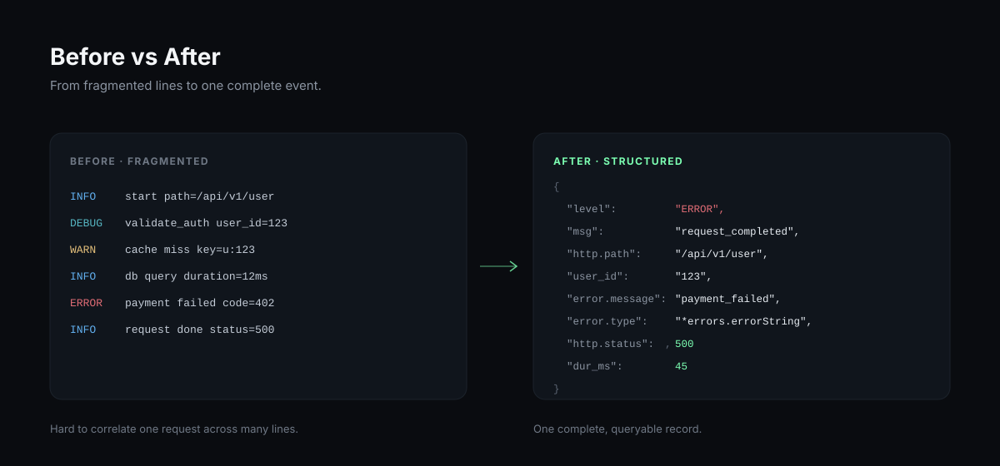

# happycontext



[](https://github.com/happytoolin/happycontext/actions/workflows/ci.yml)
[](https://github.com/happytoolin/happycontext/actions/workflows/release.yml)
[](https://pkg.go.dev/github.com/happytoolin/happycontext)
[](https://go.dev/)
[](./LICENSE)

Most application logs are high-volume but low-context.
`happycontext` helps Go services emit one structured, canonical event per request, so debugging and analysis start from a complete record instead of scattered lines.



## Why happycontext?

- Cleaner logs with one canonical event per request
- Consistent fields across handlers, middleware, and frameworks
- Built-in sampling for healthy traffic
- Error and panic events are always preserved
- Works with `slog`, `zap`, and `zerolog`
- Integrates with `net/http`, `gin`, `echo`, `fiber`, `fiber v3`, and worker jobs

Design principle:

- Prefer one context-rich request event over many fragmented log lines.
  

## Install

```bash
go get github.com/happytoolin/happycontext
go get github.com/happytoolin/happycontext/adapter/slog
go get github.com/happytoolin/happycontext/integration/std
```

Install only the adapter and integration packages you use.

## Quick Start (`net/http` + `slog`)

Compile the runtime once, wrap the handler, annotate with `hc.Add`:

```go
package main

import (
	"errors"
	"log/slog"
	"net/http"
	"os"

	hc "github.com/happytoolin/happycontext"
	sloghc "github.com/happytoolin/happycontext/adapter/slog"
	stdhc "github.com/happytoolin/happycontext/integration/std"
)

func main() {
	logger := slog.New(slog.NewJSONHandler(os.Stdout, nil))
	sink := sloghc.New(logger)

	rt := hc.MustCompile(hc.Config{
		Sink:         sink,
		SamplingRate: 1.0,
	})
	mw := stdhc.Middleware(rt)

	mux := http.NewServeMux()
	mux.HandleFunc("GET /orders/{id}", func(w http.ResponseWriter, r *http.Request) {
		hc.Add(r.Context(), "user_id", "u_8472", "feature", "checkout")
		if r.URL.Query().Get("fail") == "1" {
			hc.SetMessage(r.Context(), "checkout_failed")
			hc.Error(r.Context(), errors.New("checkout failed"))
			http.Error(w, "internal error", http.StatusInternalServerError)
			return
		}
		hc.SetMessage(r.Context(), "checkout_succeeded")
		w.WriteHeader(http.StatusOK)
	})

	_ = http.ListenAndServe(":8080", mw(mux))
}
```

Other quick starts:

- `net/http + zap` and `net/http + zerolog` are in `## More Examples`
- `gin`, `echo`, `fiber v2`, and `fiber v3` (with `slog`) are in `## More Examples`
- Runnable reference apps are in `cmd/examples`
- Zero-dependency output: `hc.NewJSONSink(os.Stdout)` needs no logger at all

## Quick Start (Background Job)

```go
func runImport(ctx context.Context, rt *hc.Runtime) (err error) {
	op := hc.Start(ctx, rt, hc.OperationStart{
		Domain:      hc.DomainJob,
		Name:        "import",
		ID:          "job_8472",
		Attempt:     2,
		MaxAttempts: 3,
	})
	defer op.End(&err) // captures errors AND panics; re-panics

	hc.Add(ctx, "rows", 42, "source", "queue")
	return doImport(ctx)
}
```

One event, always: header fields, handler fields in attach order, and
completion fields — deterministic by construction. Failures are never
sampled away.

## Configuration

Compile once at startup; `*hc.Runtime` is immutable and shared by all
requests. Invalid configuration is a construction-time error
(`hc.ErrInvalidRate`, `hc.ErrInvalidLevel`, `hc.ErrInvalidOutcome`) —
use `hc.Compile` for config from files, `hc.MustCompile` for literals.

`hc.Config` gives you the core controls:

- `Sink`: destination logger adapter (required to emit events)
- `SamplingRate`: `0` drops healthy events, `1` keeps all healthy events
- `LevelSamplingRates`: optional level-specific sampling overrides
- `Sampler`: optional custom sampling function (full control)
- `OperationPolicies`: optional per-domain level/sampling policy for all lifecycle domains, including HTTP and background operations; domain sampling overrides generic level/default sampling
- `Message`: final log message (defaults to `hc.DefaultMessage` for HTTP and `hc.DefaultOperationMessage` for non-HTTP)

Notes:

- Sampling is automatically bypassed for errors and server failures.
- If no sink is configured, requests still run; logging is skipped.
- Sampling behavior is consistent across all integrations (`net/http`, `gin`, `echo`, `fiber`, and `fiber v3`).
- `hc.SetMessage(ctx, "...")` overrides `Config.Message` for a single event.

### Per-request Message Override

Use `hc.SetMessage` when a route or handler should emit a more specific final message than the integration-wide default:

```go
func checkoutHandler(w http.ResponseWriter, r *http.Request) {
	if err := processCheckout(r.Context()); err != nil {
		hc.SetMessage(r.Context(), "checkout_failed")
		hc.Error(r.Context(), err)
		http.Error(w, "internal error", http.StatusInternalServerError)
		return
	}

	hc.SetMessage(r.Context(), "checkout_succeeded")
	w.WriteHeader(http.StatusOK)
}
```

Passing an empty string leaves the event on the configured default message.

Errors are recorded as structured metadata:

```json
{
  "error": {
    "message": "checkout failed",
    "type": "*errors.errorString"
  }
}
```

### Sampling Customization

Per-level sampling:

```go
mw := stdhc.Middleware(hc.MustCompile(hc.Config{
	Sink:         sink,
	SamplingRate: 0.05, // default for healthy traffic
	LevelSamplingRates: map[hc.Level]float64{
		hc.LevelWarn:  1.0, // keep all warns
		hc.LevelDebug: 0.01,
	},
})
```

Custom sampler (route/user/latency rules):

```go
mw := stdhc.Middleware(hc.MustCompile(hc.Config{
	Sink: sink,
	Sampler: func(in hc.SampleInput) bool {
		// Always keep failures and slow requests.
		if in.HasError || in.StatusCode >= 500 {
			return true
		}
		if in.Duration > 2*time.Second {
			return true
		}
		// Keep checkout requests.
		if in.Path == "/api/checkout" {
			return true
		}
		// Keep enterprise requests based on event fields.
		fields := hc.EventFields(in.Event)
		tier, _ := fields["user_tier"].(string)
		return tier == "enterprise"
	},
})
```

`hc.EventFields` returns a shallow copy of top-level fields. Nested maps/slices are shared references.

`hc.Add` accepts one or more key/value pairs:
`hc.Add(ctx, "k1", v1, "k2", v2, "k3", v3)`.

`hc.SampleInput.Method`, `Path`, and `StatusCode` are HTTP compatibility fields.
For non-HTTP operations use `Domain`, `Operation`, `Outcome`, and `Code`.

Built-in sampler chain:

```go
mw := stdhc.Middleware(hc.MustCompile(hc.Config{
	Sink: sink,
	Sampler: hc.ChainSampler(
		hc.RateSampler(0.05),        // base sampler
		hc.KeepErrors(),             // always keep errors
		hc.KeepPathPrefix("/admin"), // always keep admin paths
		hc.KeepSlowerThan(500*time.Millisecond),
	),
}))
```

Sampler building blocks:

- `hc.ChainSampler(base, middlewares...)`: composes one final `Sampler` from middleware rules.
- `hc.AlwaysSampler()`: base sampler that keeps every event.
- `hc.NeverSampler()`: base sampler that drops every event.
- `hc.RateSampler(rate)`: base probabilistic sampler (`0` drops all, `1` keeps all).
- `hc.KeepErrors()`: middleware that keeps errored requests (`HasError` or `5xx`).
- `hc.KeepPathPrefix("/checkout", "/admin")`: middleware that keeps matching path prefixes.
- `hc.KeepSlowerThan(minDuration)`: middleware that keeps requests at/above a duration threshold.

### Generic Operation Lifecycle API

For non-HTTP flows, use `hc.Start` with the compiled runtime:

```go
func runJob(ctx context.Context, rt *hc.Runtime) (err error) {
	op := hc.Start(ctx, rt, hc.OperationStart{
		Domain: hc.DomainJob,
		Name:   "invoice.reconcile",
		ID:     "job_1001",
		Source: "nightly",
	})
	defer op.End(&err) // direct defer: captures errors and panics

	hc.Add(op.Context(), "account_id", "acct_42")
	return nil
}
```

`op.End(&err)` is the only completion path: one-shot, returning whether
the event was emitted. The `worker` integration wraps this idiom for
queue consumers.

## Integrations

- `integration/std` (`net/http`)
- `integration/gin`
- `integration/echo`
- `integration/fiber` (Fiber v2)
- `integration/fiberv3` (Fiber v3)
- `integration/worker` (background jobs/non-HTTP operations)

## Logger Adapters

- `adapter/slog`
- `adapter/zap`
- `adapter/zerolog`

Adapters expose `New` only (the `SinkOptions`/`NewWithOptions` shapes
were removed at 1.0: nothing to configure until proven otherwise).
Fields arrive in insertion order, deterministically, as typed
constructors.

### First-party JSON sink (no logger dependency)

`hc.NewJSONSink(w io.Writer)` emits the same canonical event shape as the
zerolog adapter — lowercase `level`, RFC3339 `time`, your fields, `message`
last — as one JSON line per event, with zero dependencies beyond the
standard library:

```go
sink := hc.NewJSONSink(os.Stdout)
```

The wire format matches `zerolog.New(w).With().Timestamp().Logger()`
through `adapter/zerolog`, so existing pipelines ingest it unchanged.
Field order remains unspecified (map-based, same as the adapters).

## More Examples

<details>
<summary>1. net/http + slog</summary>

```go
package main

import (
	"log/slog"
	"net/http"
	"os"

	hc "github.com/happytoolin/happycontext"
	sloghc "github.com/happytoolin/happycontext/adapter/slog"
	stdhc "github.com/happytoolin/happycontext/integration/std"
)

func main() {
	logger := slog.New(slog.NewJSONHandler(os.Stdout, nil))
	sink := sloghc.New(logger)
	mw := stdhc.Middleware(hc.MustCompile(hc.Config{Sink: sink, SamplingRate: 1}))

	mux := http.NewServeMux()
	mux.HandleFunc("/health", func(w http.ResponseWriter, r *http.Request) {
		hc.Add(r.Context(), "router", "net/http")
		w.WriteHeader(http.StatusOK)
	})

	_ = http.ListenAndServe(":8101", mw(mux))
}
```

</details>

<details>
<summary>2. gin + slog</summary>

```go
package main

import (
	"log/slog"
	"os"

	"github.com/gin-gonic/gin"
	hc "github.com/happytoolin/happycontext"
	sloghc "github.com/happytoolin/happycontext/adapter/slog"
	ginhc "github.com/happytoolin/happycontext/integration/gin"
)

func main() {
	logger := slog.New(slog.NewJSONHandler(os.Stdout, nil))
	sink := sloghc.New(logger)

	r := gin.New()
	r.Use(ginhc.Middleware(hc.MustCompile(hc.Config{Sink: sink, SamplingRate: 1}))
	r.GET("/users/:id", func(c *gin.Context) {
		hc.Add(c.Request.Context(), "router", "gin")
		c.Status(200)
	})

	_ = r.Run(":8105")
}
```

</details>

<details>
<summary>3. fiber v2 + slog</summary>

```go
package main

import (
	"log/slog"
	"os"

	"github.com/gofiber/fiber/v2"
	hc "github.com/happytoolin/happycontext"
	sloghc "github.com/happytoolin/happycontext/adapter/slog"
	fiberhc "github.com/happytoolin/happycontext/integration/fiber"
)

func main() {
	logger := slog.New(slog.NewJSONHandler(os.Stdout, nil))
	sink := sloghc.New(logger)

	app := fiber.New()
	app.Use(fiberhc.Middleware(hc.MustCompile(hc.Config{Sink: sink, SamplingRate: 1}))
	app.Get("/users/:id", func(c *fiber.Ctx) error {
		hc.Add(c.UserContext(), "router", "fiber-v2")
		return c.SendStatus(200)
	})

	_ = app.Listen(":8107")
}
```

</details>

<details>
<summary>4. fiber v3 + slog</summary>

```go
package main

import (
	"log/slog"
	"os"

	"github.com/gofiber/fiber/v3"
	hc "github.com/happytoolin/happycontext"
	sloghc "github.com/happytoolin/happycontext/adapter/slog"
	fiberv3hc "github.com/happytoolin/happycontext/integration/fiberv3"
)

func main() {
	logger := slog.New(slog.NewJSONHandler(os.Stdout, nil))
	sink := sloghc.New(logger)

	app := fiber.New()
	app.Use(fiberv3hc.Middleware(hc.MustCompile(hc.Config{Sink: sink, SamplingRate: 1}))
	app.Get("/users/:id", func(c fiber.Ctx) error {
		hc.Add(c.Context(), "router", "fiber-v3")
		return c.SendStatus(200)
	})

	_ = app.Listen(":8108")
}
```

</details>

<details>
<summary>5. echo + slog</summary>

```go
package main

import (
	"log/slog"
	"os"

	hc "github.com/happytoolin/happycontext"
	sloghc "github.com/happytoolin/happycontext/adapter/slog"
	echohc "github.com/happytoolin/happycontext/integration/echo"
	"github.com/labstack/echo/v4"
)

func main() {
	logger := slog.New(slog.NewJSONHandler(os.Stdout, nil))
	sink := sloghc.New(logger)

	e := echo.New()
	e.Use(echohc.Middleware(hc.MustCompile(hc.Config{Sink: sink, SamplingRate: 1}))
	e.GET("/users/:id", func(c echo.Context) error {
		hc.Add(c.Request().Context(), "router", "echo")
		return c.NoContent(200)
	})

	_ = e.Start(":8106")
}
```

</details>

<details>
<summary>6. net/http + zap</summary>

```go
package main

import (
	"net/http"

	hc "github.com/happytoolin/happycontext"
	zaphc "github.com/happytoolin/happycontext/adapter/zap"
	stdhc "github.com/happytoolin/happycontext/integration/std"
	"go.uber.org/zap"
)

func main() {
	logger := zap.NewExample()
	sink := zaphc.New(logger)
	mw := stdhc.Middleware(hc.MustCompile(hc.Config{Sink: sink, SamplingRate: 1}))

	mux := http.NewServeMux()
	mux.HandleFunc("/health", func(w http.ResponseWriter, r *http.Request) {
		hc.Add(r.Context(), "example", "adapter-zap")
		w.WriteHeader(http.StatusOK)
	})

	_ = http.ListenAndServe(":8102", mw(mux))
}
```

</details>

<details>
<summary>7. net/http + zerolog</summary>

```go
package main

import (
	"net/http"
	"os"

	hc "github.com/happytoolin/happycontext"
	zerologhc "github.com/happytoolin/happycontext/adapter/zerolog"
	stdhc "github.com/happytoolin/happycontext/integration/std"
	"github.com/rs/zerolog"
)

func main() {
	logger := zerolog.New(os.Stdout).With().Timestamp().Logger()
	sink := zerologhc.New(&logger)
	mw := stdhc.Middleware(hc.MustCompile(hc.Config{Sink: sink, SamplingRate: 1}))

	mux := http.NewServeMux()
	mux.HandleFunc("/health", func(w http.ResponseWriter, r *http.Request) {
		hc.Add(r.Context(), "example", "adapter-zerolog")
		w.WriteHeader(http.StatusOK)
	})

	_ = http.ListenAndServe(":8103", mw(mux))
}
```

</details>

Runnable commands are also available in `cmd/examples`:

```bash
cd cmd/examples
go run ./adapter-slog
go run ./adapter-zap
go run ./adapter-zerolog
go run ./router-std
go run ./router-gin
go run ./router-echo
go run ./router-fiber
go run ./router-fiberv3
go run ./sampling-inbuilt
go run ./sampling-custom
go run ./worker-job
```

## Release Process

- CI: `.github/workflows/ci.yml`
- Release automation: `.github/workflows/release.yml`
- Go proxy sync: `.github/workflows/go-proxy-sync.yml`
- Root module releases must be tagged as `vX.Y.Z`.
- Nested Go modules must be tagged as `<subdir>/vX.Y.Z` so `go list -m -versions` can discover them.
- To backfill historical tags created with the old `happycontext-vX.Y.Z` format, run `./scripts/backfill-go-tags.sh` and push the generated tags.

Published nested modules:

- `adapter/slog`
- `adapter/zap`
- `adapter/zerolog`
- `integration/echo`
- `integration/fiber`
- `integration/fiberv3`
- `integration/gin`
- `integration/std`
- `integration/worker`

## Migrating from v0.x

Coming from a 0.x release? [`MIGRATION.md`](./MIGRATION.md) maps every
removed or changed symbol, the outcome-precedence change, and the wire
format differences.

## References

- Framing inspiration: "Logging Sucks - Your Logs Are Lying To You" by Boris Tane: https://loggingsucks.com/

## License

MIT
